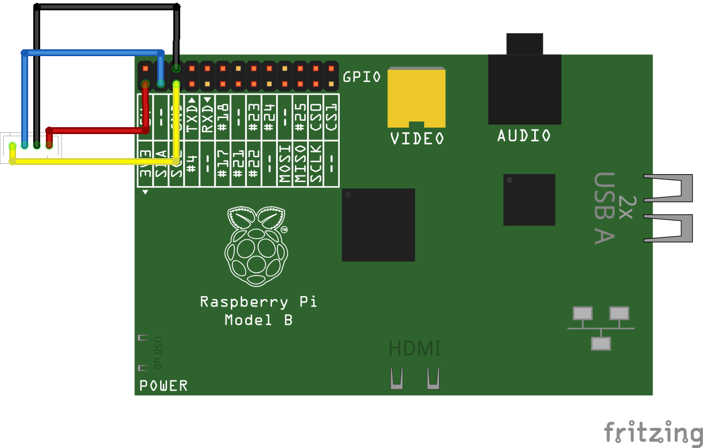

# Python Person Sensor Example for a Raspberry Pi

## Introduction

The Person Sensor is a small hardware module that's intended to make it easy to
find out when people are near a device, where they are, and who they are. It has
an image sensor and a microcontroller with pretrained ML models that use
computer vision to spot faces. 

There's a [detailed developer guide](https://usfl.ink/ps_dev)
available, but this project has sample code that shows you specifically how to 
get the sensor up and running with a Raspberry Pi using Python.

## Configure Your Pi

Before you can use I2C on your Raspberry Pi, you'll need to enable it using the
`raspi-config` shell command. Open up a new terminal window, type
`sudo raspi-config`, enter your password, and then use the arrow keys to
navigate to the `Interfacing Options` section. Go to the `I2C` menu item, press
return to enable it, and then go down to `Finish` to commit the change.

Now, if you run the command `ls /dev/*i2c*` you should see `/dev/i2c-1` in the
results.

## Wiring

For this example we'll be using the first I2C bus. If you're using a standard
[Qwiic connector](https://www.sparkfun.com/qwiic), the colors will be black for 
GND, red for 3.3V, blue for SDA, and yellow for SDC. You'll connect GND to pin
6, 3.3V to pin 1, SDA to pin 3, and SDC to pin 5.



## Install I2C Tools

You can check that the sensor is wired correctly using a command line utility.
First run this command to install the tools:

```bash
sudo apt-get install -y i2c-tools
```

When that is complete run the following command to list all the devices found
on the I2C bus:

```
i2cdetect -y 1
```

You should see something like this grid of text:

```
     0  1  2  3  4  5  6  7  8  9  a  b  c  d  e  f
00:                         -- -- -- -- -- -- -- -- 
10: -- -- -- -- -- -- -- -- -- -- -- -- -- -- -- -- 
20: -- -- -- -- -- -- -- -- -- -- -- -- -- -- -- -- 
30: -- -- -- -- -- -- -- -- -- 39 -- -- -- -- -- -- 
40: -- -- -- -- -- -- -- -- -- -- -- -- -- -- -- 4f 
50: -- -- -- -- -- -- -- -- -- -- -- -- -- -- -- -- 
60: -- -- 62 -- -- -- -- -- -- -- -- -- -- -- -- -- 
70: -- -- -- -- -- -- -- --
```

This is listing all the I2C addresses that have been found. The important one
for the person sensor is 62, which is the hexadecimal address of the device. If
this doesn't show up in the grid, then the sensor is not being detected and it's
likely that something is wrong with the wiring.

As another troubleshooting step, you can point the sensor's camera at your own
face. If the GND and 3.3V wires are correctly attached, then you should see a
green LED light up as it recognizes a person. If that does work, but the sensor
isn't found by `i2cdetect` then it's likely either the SDA/SDC wiring is
incorrect, or the I2C interface hasn't been enabled correctly.

## Run the Script

If everything is set up correctly, you can run the example script like this:

```bash
python person_sensor.py
```

You should see logging output showing information about the people the script
is detecting. Here's an example:

```Python
1 [{'box_confidence': 98, 'box_left': 101, 'box_top': 49, 'box_width': 134, 'box_height': 103, 'id_confidence': 0, 'id': -1, 'is_facing': 0}]
```